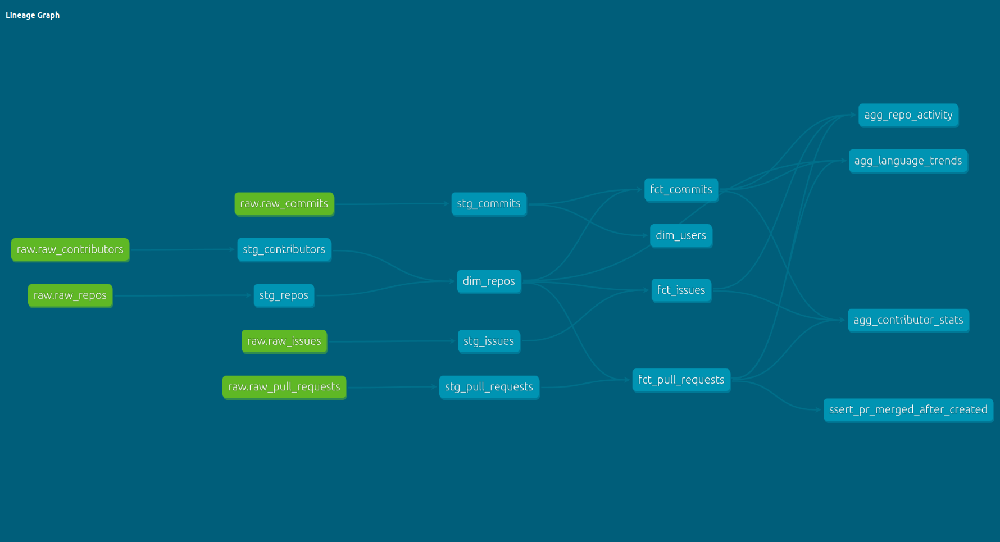

# GitHub Analytics Pipeline

An end-to-end ELT pipeline that ingests GitHub activity data from the REST API, loads it into Snowflake, and transforms it into an analytics-ready data warehouse using dbt.

---

## What it does

Tracks activity across 13 popular open-source repositories — including Apache Spark, Airflow, PyTorch, TensorFlow, and others — and models the data into facts, dimensions, and aggregations that answer questions like:

- Which repos are most actively maintained?
- How long does it take for PRs to get merged?
- Who are the top contributors across the ecosystem?
- Which programming languages have the most community activity?
- How do issue resolution times compare across repos?

---

## Architecture

```
GitHub REST API
      │
      ▼
PySpark Ingestion
(fetch repos, commits, PRs, issues, contributors)
      │
      ▼
Local Parquet Files
      │
      ▼
Snowflake RAW Schema
(PUT + COPY INTO bulk load)
      │
      ▼
dbt Staging Layer
(clean, rename, deduplicate)
      │
      ▼
dbt Analytics Layer
(facts, dimensions, aggregations)
```

---

## Stack

| Layer | Tool |
|---|---|
| Ingestion | Python + PySpark |
| Storage | Local Parquet |
| Warehouse | Snowflake |
| Loading | Snowflake Internal Stage + COPY INTO |
| Transformation | dbt Core |
| Source | GitHub REST API |

---

## Data Collected

| Entity | Rows |
|---|---|
| Repositories | 13 |
| Commits | 5,960 |
| Pull Requests | 6,000 |
| Issues | 1,847 |
| Contributors | 2,352 |

---

## Snowflake Schema Design

Three schemas follow the standard warehouse layering pattern:

- **RAW** — raw tables loaded directly from the API, never modified
- **STAGING** — dbt views, one per raw table, cleaned and typed
- **ANALYTICS** — dbt tables, facts, dimensions, and aggregations for analysis

---

## dbt Models

**Staging**
- `stg_repos` — cleaned repo metadata
- `stg_commits` — cleaned commit data
- `stg_pull_requests` — cleaned PR data with deduplication
- `stg_issues` — cleaned issue data
- `stg_contributors` — cleaned contributor data

**Dimensions**
- `dim_repos` — one row per repo with contributor counts
- `dim_users` — one row per unique contributor with commit stats

**Facts**
- `fct_commits` — one row per commit with week and month partitions
- `fct_pull_requests` — one row per PR with derived metrics (merge time, PR size, merge rate)
- `fct_issues` — one row per issue with derived metrics (close time, discussion level)

**Aggregations**
- `agg_repo_activity` — per-repo summary of commits, PRs, and issues with closure rates
- `agg_language_trends` — activity and popularity metrics grouped by programming language
- `agg_contributor_stats` — per-contributor activity breakdown across repos

---

## Lineage Graph

The dbt lineage graph below shows how data flows from raw sources through staging into the analytics layer.

<!-- Screenshot: full lineage graph from dbt docs (dbt docs serve → lineage graph → expand all) -->


## Key Engineering Decisions

**PUT + COPY INTO over write_pandas()** — data is loaded into Snowflake using Parquet files staged in Snowflake's internal stage and bulk loaded via COPY INTO. This is the production-standard loading pattern and significantly faster than row-by-row inserts.

**Deduplication with ROW_NUMBER()** — duplicate records from API pagination overlap are handled in staging using ROW_NUMBER() partitioned by the primary key, keeping the most recently ingested record.

**Explicit schema over inference** — Spark schemas are declared explicitly in every ingestion script rather than inferred, preventing type mismatches between the API response and the warehouse.

**ELT not ETL** — raw data is loaded into Snowflake first and transformed inside the warehouse using dbt, keeping transformation logic version-controlled and testable.

---

## Tests

45 dbt tests cover the full model layer:

- `not_null` and `unique` constraints on all primary keys
- `accepted_values` on categorical columns like `pr_state`, `pr_size`, `discussion_level`
- `relationships` tests for foreign key integrity between facts and dimensions
- A custom singular test asserting no PR has a `merged_at` timestamp earlier than `created_at`

---

## Project Structure

```
github-analytics/
├── ingestion/
│   ├── ingest_repos.py
│   ├── ingest_commits.py
│   ├── ingest_pull_requests.py
│   ├── ingest_issues.py
│   ├── ingest_contributors.py
│   └── load_to_snowflake.py
├── dbt_project/
│   ├── models/
│   │   ├── staging/
│   │   │   ├── sources.yml
│   │   │   ├── schema.yml
│   │   │   └── stg_*.sql
│   │   └── marts/
│   │       ├── schema.yml
│   │       ├── dim_*.sql
│   │       ├── fct_*.sql
│   │       └── agg_*.sql
│   ├── tests/
│   │   └── assert_pr_merged_after_created.sql
│   └── macros/
│       └── generate_schema_name.sql
├── data/                        # gitignored
├── .env                         # gitignored
└── README.md
```

---

## Running the Pipeline

**1. Set up environment**

```bash
python -m venv venv
source venv/bin/activate
pip install -r requirements.txt
```

Add a `.env` file with your GitHub token and Snowflake credentials:

```
GITHUB_TOKEN=your_token
SNOWFLAKE_ACCOUNT=your_account
SNOWFLAKE_USER=your_user
SNOWFLAKE_PASSWORD=your_password
SNOWFLAKE_DATABASE=github_analytics
SNOWFLAKE_WAREHOUSE=github_wh
```

**2. Run ingestion**

```bash
python ingestion/ingest_repos.py
python ingestion/ingest_commits.py
python ingestion/ingest_pull_requests.py
python ingestion/ingest_issues.py
python ingestion/ingest_contributors.py
```

**3. Load into Snowflake**

```bash
python ingestion/load_to_snowflake.py
```

**4. Run dbt**

```bash
cd dbt_project
dbt run
dbt test
dbt docs generate && dbt docs serve
```

---

## Repos Tracked

| Repo | Language |
|---|---|
| apache/spark | Scala |
| apache/airflow | Python |
| dbt-labs/dbt-core | Python |
| pandas-dev/pandas | Python |
| tiangolo/fastapi | Python |
| django/django | Python |
| pytorch/pytorch | Python |
| tensorflow/tensorflow | C++ |
| microsoft/vscode | TypeScript |
| golang/go | Go |
| rust-lang/rust | Rust |
| vercel/next.js | JavaScript |
| snowflakedb/snowflake-connector-python | Python |